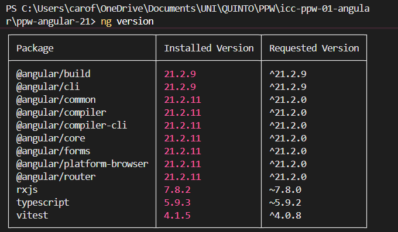
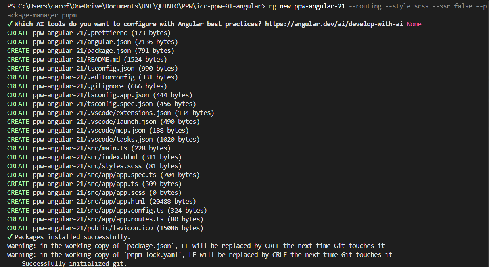
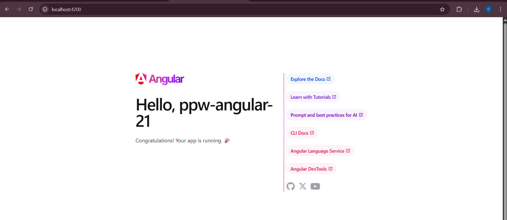
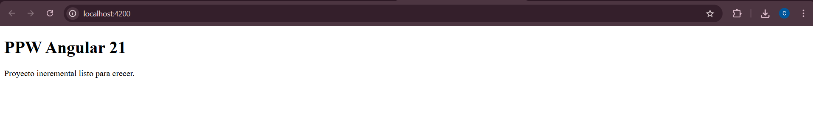

# Práctica 1 - Configuración inicial de Angular

*Carolina Fortmann*

This project was generated using [Angular CLI](https://github.com/angular/angular-cli) version 21.2.9.

## 1.- Pasos importantes para la configuración:

Antes de comenzar, es necesario contar con las siguientes herramientas instaladas en el sistema:

- **Node.js:** Motor de ejecución para JavaScript. Fue descargado en: [nodejs.org](https://nodejs.org/).
- **pnpm:** Gestor de paquetes eficiente. Se instala mediante el comando dentro del cmd:
    ```bash
    npm install -g pnpm
    ```
- **Angular CLI (v21+):** Interfaz de línea de comandos de Angular. Instalado en el cmd:
    ```bash
    pnpm add -g @angular/cli
    ```

### 2.- Creación del proyecto en VSC:

Se emplearon los siguientes comandos dentro del terminal de una carpeta previamente creada:
```bash
ng new ppw-angular-21 --routing --style=scss --ssr=false
cd ppw-angular-21
pnpm install
pnpm start
```
Esto nos retorna una página web del navegador: `http://localhost:4200/`. La aplicación se encarga de actualizar automáticamente esta página cada vez que se modifica algún archivo.

## 3.- Capturas:

### 1. Salida de ```ng version``` en el terminal:


**Descripción:** Se verifica la versión actual de Angular que fue previamente instalado.


### 2. Proceso de creación del proyecto con Angular CLI:


**Descripción:** Se ejecuta el comando de creación del proyecto.

### 3. Página de bienvenida de Angular antes de modificar:


**Descripción:** Página inicial de bienvenida en localhost:42000.


### 4. HomePage funcionando en ```localhost:4200```:


**Descripción:** Página después de los ajustes en las clases.
